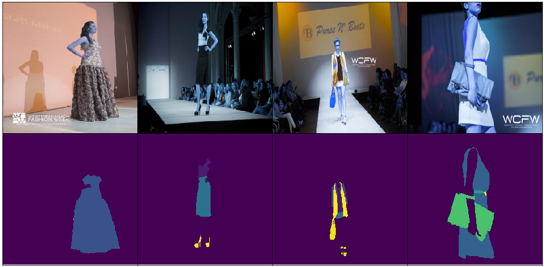

# Segmentation task for fashion and apparel
This repository contains the implementations of SegNet, U-Net, Atrous Resnet-50, FCN ResNet-50 and DenseNet, which are capable of identifying 46 pre-defined categories. This was developed by Mariana Ramirez Duque and Hassler Castro Cuesta as a final project for the Artificial Intelligence course dictated between Universidad EAFIT and Landing AI.

## Introduction:
The Fashion Industry is a strong and important industry in the global economy. Globalization has bring fast fashion, quick shifting consumer shopping preferences,  more competition and abundance in fashion shops and retailers, making it more difficult for professionals in the fashion industry to keep track of what fashion items people wear and how they combine them. We address this problem by implementing various semantic segmentationmodels which are capable of identifying multiple fashion items in 46 pre-defined categories.

## Dataset: 
The  iMaterialist    (Fashion)    2019    dataset    (iMFD),which   we   work   on   in   this   project,   is   available   on <https://www.kaggle.com/c/imaterialist-fashion-2019-FGVC6/data.This>
This dataset   contains   50,000   clothing   images   (40,00with  apparel  instance  segmentation  and  10,000  with  bothsegmentation   and   fine-grained   attributes)   in   daily-life, celebrity events, and online shopping, which were labeled by both domain experts and crowd workers.

*Figure 1. Randomly chosen images with their desired output*

## Results: 

