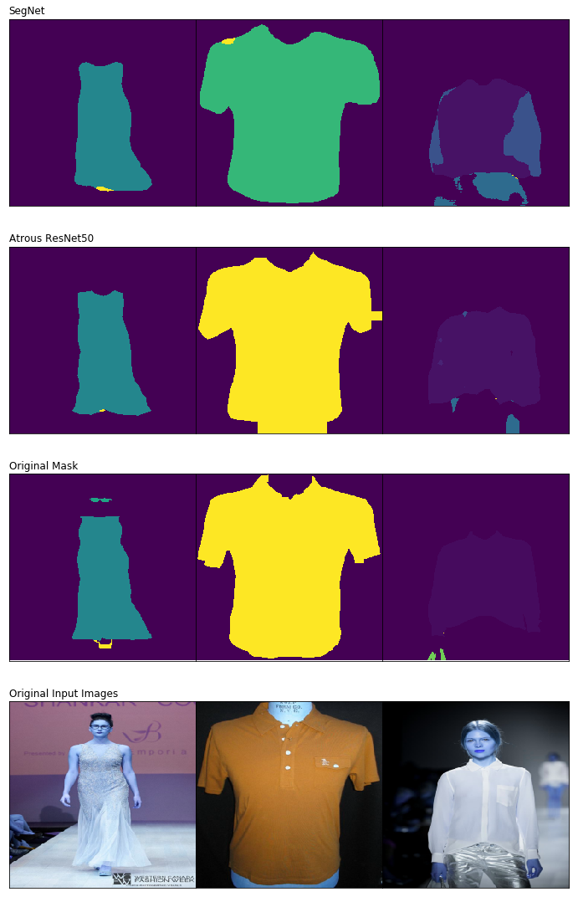

# Segmentation task for fashion and apparel
This repository contains the implementations of SegNet, U-Net, Atrous Resnet-50, FCN ResNet-50 and DenseNet, which are capable of identifying 46 pre-defined categories. This was developed by Mariana Ramirez Duque and Hassler Castro Cuesta as a final project for the Artificial Intelligence course dictated between Universidad EAFIT and Landing AI.

## Introduction:
The Fashion Industry is a strong and important industry in the global economy. Globalization has bring fast fashion, quick shifting consumer shopping preferences,  more competition and abundance in fashion shops and retailers, making it more difficult for professionals in the fashion industry to keep track of what fashion items people wear and how they combine them. We address this problem by implementing various semantic segmentationmodels which are capable of identifying multiple fashion items in 46 pre-defined categories.

## Dataset: 
The  iMaterialist    (Fashion)    2019    dataset    (iMFD),which   we   work   on   in   this   project,   is   available   on <https://www.kaggle.com/c/imaterialist-fashion-2019-FGVC6/data.This>
This dataset   contains   50,000   clothing   images   (40,00with  apparel  instance  segmentation  and  10,000  with  bothsegmentation   and   fine-grained   attributes)   in   daily-life, celebrity events, and online shopping, which were labeled by both domain experts and crowd workers.

*Figure 1. Randomly chosen images with their desired output*

## Code Architecture

#### Folders

    - /Models: Contains every used model: 
        - SegNet
        - U-Net
        - Atrous ResNet 50
        - FCN ResNet 50
        - DeepNet 
    
    - /weights/weights_dataset_models
        - Download weights here

#### Files

    utilities.py : Contains some useful functions, and the following losses and metrics:
        - Weighted Categorical Cross Entropy
        - Focal Loss
        - Dice Loss
        - Intersection over Union

    Model.ipynb : Contains the training process of each model (models from /Models folder), and shows comparisions between them:
        - Custom data Generator.
        - Keras train method.

    DataUnderstanding.ipynb : Data analysis, and preprocessing processes:
        - Data exploration.
        - Assign one single mask to each image.
        - Custom Weights
        - Subsets

    Results.ipynb : Training results:
        - Training and validation losses
        - Comparision between SegNet and Atrous - ResNet50
    
    Demo.ipynb: Notebook where you can try your own images

## Results: 

We trained on a NVIDIA k80 GPU, some results are shown next:

Model: SegNet
    
    Predicted Categories: 
    Image0:  ['top, t-shirt, sweatshirt', 'jacket', 'shorts']
    Image1:  ['top, t-shirt, sweatshirt', 'dress']
    Image2:  ['dress']

Model: Atrous ResNet50
    
    Predicted Categories: 
    Image0:  ['top, t-shirt, sweatshirt', 'jacket', 'shorts']
    Image1:  ['dress']
    Image2:  ['dress', 'shoe']

Real categories
    
    Image0:  ['tassel', 'top, t-shirt, sweatshirt', 'jacket', 'shorts']
    Image1:  ['tassel', 'top, t-shirt, sweatshirt', 'dress']
    Image2:  ['tassel', 'dress']

## Try your own images

    - Prerequisites 
    
    conda create --name <environmentname>
    conda activate <environmentname>

    pip install -r requirements.txt

    Download models [weights](https://drive.google.com/open?id=14A_g5tHHFfEjL4o4MAVl-CDvhhHAUTVu) and place them in the _weigths_dataset_models_ folder

    You are done! 
